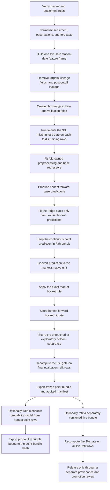

# Temperature units, market buckets, and the full training pipeline

Use this guide when creating, retraining, or reviewing a station notebook. It
supplements the [notebook standard](NOTEBOOK_STANDARD.md) and the
[station-training SOP](SOP.md).

The most important rule is that these are separate contracts:

1. the **settlement contract** says which observation resolves the market;
2. the **point-model contract** says what continuous value the regressor learns;
3. the **market-bucket contract** maps a continuous value to a winning bracket;
4. the **probability contract**, if enabled, estimates uncertainty around those
   market brackets.

Do not infer one contract from another. A point model trained in Fahrenheit can
correctly serve a whole-Celsius market as long as scoring converts the
continuous prediction into Celsius before applying the market's rounding rule.

## Full pipeline at a glance



The notebook must preserve this direction of information. Holdout outcomes,
final daily observations, and later refit decisions must never flow backward
into feature selection, preprocessing, tuning, or earlier validation folds.

## Phase 1: freeze the market and settlement contract

Do this before selecting providers or features. Save the evidence used to
answer each question.

| Question | What must be recorded |
|---|---|
| What resolves the market? | Station, source, observation type, and contract date timezone |
| What is the native unit? | Celsius or Fahrenheit as supplied by the resolving source |
| What does the UI display? | Display unit and precision; this may differ from the native source |
| How is a bracket chosen? | Half-up, floor, truncation, or an explicit interval definition |
| What is the bucket width? | One Celsius degree, two Fahrenheit degrees, or another width |
| What are the tails? | Closed finite buckets or open-ended low/high buckets |
| When is the target final? | Resolution time and rules for later corrections |

Keep screenshots or source URLs as research evidence, but implement the
verified rule as a named, tested code contract. Never derive a settlement rule
only from how a frontend happens to render a converted temperature.

### Native value versus converted display

Prefer the native settlement value. A Fahrenheit display converted from a
whole-Celsius observation is not a separate Fahrenheit settlement.

For example:

```text
native settlement: 33 C
exact conversion:  91.4 F
possible display:  91 F
winning bracket:   33 C
```

The rounded `91 F` display must not be converted back and treated as a new,
lower-precision settlement measurement.

## Phase 2: choose and test the market-bucket contract

Set `point_bucket_contract` in the station config. The shared implementation is
`src/calibration/temperature_buckets.py`.

| Contract | Exact mapping | Bucket representation | Current use |
|---|---|---|---|
| `polymarket_half_up_1c` | `floor(((F - 32) * 5 / 9) + 0.5)` | nearest whole Celsius degree | Tokyo and Seoul |
| `polymarket_half_up_2f` | half-up round `F`, then group adjacent integer degrees | `..., 88-89, 90-91, 92-93, ...` | Fahrenheit two-degree markets such as KDAL |
| `floor_1c` | `floor((F - 32) * 5 / 9)` | Celsius interval `[n,n+1)` | floor-based Celsius markets |

Half-up is not Python's built-in bankers rounding. For a value `x`, use:

```text
round_half_up(x) = floor(x + 0.5)
```

For a two-Fahrenheit-degree market:

```text
rounded_f = floor(predicted_f + 0.5)
lower_f   = rounded_f - (rounded_f mod 2)
bucket    = lower_f through lower_f + 1
```

### Worked Tokyo example

```text
continuous point prediction: 31.8 C
predicted market bucket:      floor(31.8 + 0.5) = 32 C

native final high:            32.8 C
actual market bucket:         floor(32.8 + 0.5) = 33 C

bucket error:                 predicted - actual = -1 bucket
exact bucket hit:             no
within one bucket:            yes
```

This is correct. The regressor produced a continuous estimate; bucket scoring
is a deterministic evaluation layer applied afterward.

### Required boundary tests

Every new contract needs tests immediately below, at, and above each boundary.
For half-up Celsius, include at least:

```text
31.49 -> 31
31.50 -> 32
31.51 -> 32
32.49 -> 32
32.50 -> 33
32.51 -> 33
```

Also test the conversion path from Fahrenheit, native-Celsius priority, missing
values, and representative negative temperatures.

## Phase 3: normalize data and preserve target provenance

Build one row per station and contract date. The normalized inputs should keep
source identity, issue time, availability time, and unit alongside every
temperature family.

The modeling frame normally combines:

- final settlement history;
- observations available by the inference cutoff;
- forecast providers and cycles available by the cutoff;
- station metadata and timezone;
- calendar features; and
- derived live-safe provider and observation features.

### Settlement target fields

Keep the target in its native unit when available, plus the continuous unit used
by the established point model. For a Celsius market served by a
Fahrenheit-native point model, a normalized row may contain:

```text
settlement_high_c
actual_high_c
settlement_high_f
actual_high_f
settlement_source
actual_high_c_source
quality_flag
```

For Celsius bucket scoring, target priority is:

```text
actual_high_c
    -> settlement_high_c
    -> matching actual_high_f converted to Celsius
```

The fallback is allowed only when the Fahrenheit value comes from the same
settlement observation. A diagnostic source such as `iem_daily_high_c` cannot
replace a Wunderground settlement target merely because its unit is convenient.

### Target metadata must never become features

Exclude all target-equivalent fields before numeric feature discovery,
including:

```text
actual_high_f
settlement_high_f
actual_high_c
settlement_high_c
actual_high_c_source
settlement_source
quality and target-source diagnostics
```

Retaining these columns in the dataset is useful for scoring and lineage;
excluding them from model inputs prevents target leakage.

## Phase 4: define the inference snapshot and live-safe features

Write down the exact prediction time in local time and UTC. A feature is
eligible only if its value would have been available at that snapshot on the
historical date.

For each forecast provider, verify:

- model and cycle;
- issue timestamp;
- expected publication delay;
- forecast horizon included;
- grid/station mapping;
- source archive used in training; and
- equivalent live source at inference.

For observations, verify:

- observation timestamp;
- maximum accepted age;
- report type and QC status;
- whether the observation is preliminary or revised; and
- whether it arrived before the prediction cutoff.

Never use the final daily high, later METARs, revised settlement information,
future forecast cycles, or features derived from them. A historical archive
being accessible today does not mean a field was available at the original
prediction time.

## Phase 5: define chronology before training

Chronology is part of the model contract, not merely a train/test option. Freeze
the development years, forward-validation years, exploratory holdout, and final
evaluation-refit window in the station config.

### Point-model chronology

The current Asia point workflow uses expanding folds:

| Fold | Training rows | Validation rows |
|---|---|---|
| 1 | 2022 | 2023 |
| 2 | 2022-2023 | 2024 |
| 3 | 2022-2024 | 2025 |
| Frozen evaluation refit | 2022-2025 | evaluated separately on 2026 |

For every fold:

```text
latest training timestamp < earliest validation timestamp
```

The validation predictions are honest only because their target rows were not
used to fit that fold's preprocessing, selected features, model parameters, or
weights.

### Nested Ridge stack chronology

Base-model validation predictions may feed a Ridge stack, but the stack for a
validation year must use only earlier honest validation years. Do not fit the
stack on all validation years and then report those same rows as out of sample.

Conceptually:

```text
base models trained on earlier years
    -> honest base predictions for year Y
    -> later stack fold may use those predictions as history
    -> stack prediction for year Y+1
```

### Holdout status

Once a holdout has been inspected, it remains exploratory. It cannot be renamed
out-of-fold evidence, moved into a tuning fold, or used to select thresholds and
then still be reported as untouched performance.

## Phase 6: enforce the 3% feature-missingness rule

Set the station config explicitly:

```json
"point_max_feature_missing_fraction": 0.03
```

The rule is inclusive:

```text
missing_fraction <= 0.03  -> eligible
missing_fraction >  0.03  -> excluded
```

Exactly `3.00%` missing is eligible. `3.01%` is not.

### Correct order of operations

For each candidate column inside a fit boundary:

1. isolate only that fit's training rows;
2. coerce numeric candidates to numeric, turning invalid values into missing;
3. calculate `missing_rows / training_rows`;
4. reject absent and all-missing numeric columns;
5. reject every column above `0.03`;
6. freeze the eligible feature list for that fit;
7. fit imputation and other preprocessing only on the training rows; and
8. transform validation or inference rows with the already-fitted pipeline.

Pseudocode:

```python
train = rows_for_this_fit_only

for feature in candidate_features:
    values = coerce_if_numeric(train[feature])
    missing_fraction = values.isna().mean()
    keep = values.notna().any() and missing_fraction <= 0.03

fit_preprocessor(train[kept_features])
fit_model(train[kept_features], train[target])
predict(validation[kept_features])
```

Imputation happens after eligibility. Median imputation cannot rescue a feature
that was 4% missing.

### Apply the gate at every fit boundary

The missingness calculation must be repeated independently for:

1. each base-model chronological training fold;
2. each inner tuning fit where the implementation selects features;
3. the frozen evaluation refit, using exactly its configured refit years; and
4. an optional live refit, using every completed row included in that refit.

Folds and the frozen evaluation refit select features independently. The live
refit is the exception: it must reuse the evaluation manifest's exact ordered
feature contract so research and live inference have identical dimensionality.
It still recomputes missingness on the complete live-refit population. If any
frozen feature was 2.8% missing through 2025 but becomes 3.2% missing after
adding 2026 rows, the live export must fail closed; it must not silently remove
that feature or replace it with a newly eligible feature.

This rule does not prohibit using all completed rows. It prohibits fitting on
all completed rows **with a feature whose missingness on those same rows exceeds
3%**.

### Required missingness audit

The final point manifest records, for every candidate feature:

- feature name and kind;
- exact final-refit row count;
- non-null row count;
- missing fraction;
- selected status; and
- exclusion reason.

The notebook must reject an export unless every selected row in the audit
satisfies:

```text
missing_fraction <= point_max_feature_missing_fraction
```

Review both selected and rejected features. A sudden mass exclusion often
indicates a source outage, schema change, bad numeric parsing, or incorrectly
expanded refit window.

## Phase 7: train the continuous point model

The active station pipeline fits station-specific base regressors such as:

```text
XGBoost
LightGBM
CatBoost
```

The base predictions and permitted raw provider signals feed a Ridge stack. The
primary output remains continuous:

```text
predicted_high_f
```

For a remaining-warmup target, the estimator may learn the increment from the
observed high-so-far rather than the absolute daily high. Inference converts the
model output back to `predicted_high_f` according to the station's declared
target transform.

Do not optimize only bucket accuracy and discard the continuous diagnostics.
Review at least:

- MAE and RMSE in the training unit;
- bias;
- error percentiles and large misses;
- seasonal/monthly stability;
- provider availability and feature coverage; and
- exact market-bucket metrics after unit conversion.

## Phase 8: map the point prediction to the market bucket

Keep conversion and bucketing outside the estimator:

```text
model features
    -> continuous predicted_high_f
    -> convert to market-native unit
    -> apply named rounding/bucket contract once
    -> predicted market bucket
```

The actual side follows the same market contract but starts with the matching
native settlement value:

```text
native settlement target
    -> apply named rounding/bucket contract once
    -> actual market bucket
```

Never round Fahrenheit, convert the rounded value to Celsius, and round again.
That double-rounding path can change the winning bucket.

## Phase 9: measure point-bucket performance

Point-bucket hit rate is ordinary classification accuracy after the exact market
mapping:

```text
exact bucket hit rate = bucket hits / scored rows
```

Always report:

- bucket contract name;
- scored row count;
- bucket hit count;
- exact hit rate and percentage;
- within-one-bucket rate;
- mean signed bucket error;
- mean absolute bucket error; and
- first and last scored dates.

Keep evaluation scopes in separate rows and files:

| Scope | Meaning | Valid use |
|---|---|---|
| Honest forward | Every prediction trained strictly on earlier history | Model-selection and promotion evidence if otherwise clean |
| Exploratory holdout | Frozen model scored on a previously unseen or now-inspected period | Diagnostics; not reusable as untouched evidence |
| Live resolved monitoring | Production predictions joined to later resolutions | Drift and operational monitoring |
| In-sample refit | Predictions from a model fitted on the same targets | Never report as hit-rate evidence |

Do not substitute generic `bracket_accuracy_pct` from a two-Fahrenheit-degree
contract for a whole-Celsius market. Do not confuse point-bucket hit rate with a
probability model's recommended-bucket accuracy.

## Phase 10: export the frozen point bundle

The evaluation export must use an explicit pre-holdout refit window, for
example:

```text
POINT_EVALUATION_TRAIN_YEARS = (2022, 2025)
```

At export time:

1. rebuild the modeling frame from the recorded artifacts;
2. select exactly the configured refit rows;
3. recompute the 3% missingness audit on those rows;
4. fit base models using only eligible features;
5. fit the stack from its honest validation source;
6. attach the market bucket policy;
7. write the `.joblib` bundle;
8. calculate its SHA-256;
9. write the matching JSON manifest; and
10. assert the manifest's years, bucket contract, missingness threshold, and
    bundle hash.

The point manifest must distinguish the continuous prediction contract from the
market bucket contract.

### Evaluation bundle versus live bundle

These are different artifacts:

| Bundle | Training population | Purpose |
|---|---|---|
| Evaluation | Frozen through the year before the exploratory holdout | Reproducible evidence and probability-model dependency |
| Live | All currently completed eligible actuals | Current inference candidate after separate review |

The live export must:

- have a distinct model version;
- reuse the evaluation manifest's exact ordered feature contract;
- recompute the 3% audit on its complete refit population and fail closed if a
  frozen feature violates the gate;
- never add newly eligible features during the refit;
- record a new missingness audit and bundle hash;
- remain disabled by default in the notebook; and
- never claim the already-inspected rows as fresh out-of-sample evidence.

## Phase 11: optionally train a market probability model

The probability model is downstream of the point model. It must not be used to
rewrite the point prediction or its hit rate.

Probability training consumes honest point predictions and other live-safe
features:

```text
honest point prediction
    + honest base predictions
    + live-safe probability features
    + actual market bucket
    -> ordered bucket-offset target
    -> calibrated market-bucket distribution
```

For Tokyo and Seoul:

```text
point_bucket_c = round_half_up(point_prediction_c)
actual_bucket_c = round_half_up(actual_high_c)
offset_c = actual_bucket_c - point_bucket_c
```

Preprocessing, candidate selection, regularization, calibration temperature,
and decision thresholds must be fitted inside chronological training history.
The probability bundle remains shadow-only unless a separate promotion review
approves it.

The probability manifest must contain the exact SHA-256 of the frozen point
bundle it depends on. If the point bundle changes, the dependency must be
retrained or explicitly revalidated; do not silently relink an old probability
artifact.

## Phase 12: required notebook layout

Future station notebooks should keep the following visible order:

1. title, status, station ID, timezone, and inference cutoff;
2. data roots, artifact roots, model versions, and export switches;
3. provider and settlement-source contracts;
4. market unit, bucket contract, and 3% threshold constants;
5. chronological fold table;
6. provider readiness and source coverage;
7. live-safe feature-frame construction;
8. target-leakage exclusions and feature coverage;
9. point-model configuration;
10. chronological point training and honest predictions;
11. continuous point diagnostics;
12. native-unit point-bucket forward metrics;
13. separately labeled exploratory holdout metrics;
14. frozen evaluation point export and manifest assertions;
15. optional separately versioned live refit/export;
16. optional probability training from honest point rows;
17. probability chronology and holdout verification;
18. probability bundle export and point-hash assertion; and
19. final artifact inventory and integrity checks.

Do not put unit conversion in a detached notebook. Do not hide the bucket metric
inside an ordinal-model section. The point-bucket scoreboard must be visible as
part of the point workflow.

## Phase 13: expected artifact layout

```text
data/calibration/station_training_baseline/{STATION}/
|-- {STATION}_features.csv
|-- {STATION}_year_split_validation_predictions.csv
|-- {STATION}_year_split_test_predictions.csv
|-- point_bucket_evaluation/
|   |-- {STATION}_forward_predictions.csv
|   |-- {STATION}_forward_metrics.csv
|   |-- {STATION}_{HOLDOUT}_holdout_predictions.csv
|   `-- {STATION}_{HOLDOUT}_holdout_metrics.csv
|-- model_weights/
|   |-- {STATION}_{POINT_MODEL_VERSION}.joblib
|   `-- {STATION}_{POINT_MODEL_VERSION}.json
`-- {PROBABILITY_OUTPUT_SUBDIR}/
    |-- forward and holdout prediction/metric files
    `-- model_weights/
        |-- probability bundle
        `-- probability manifest
```

Generated data and model artifacts are not the source of truth. The station
config, notebook generator, shared code, and checked-in generated notebook are
the reproducible source contract.

## Phase 14: station configuration templates

### Whole-Celsius half-up market

```json
{
  "point_bucket_contract": "polymarket_half_up_1c",
  "point_max_feature_missing_fraction": 0.03,
  "point_evaluation_train_years": [2022, 2025],
  "probability_target": "celsius_market_1c",
  "probability_holdout_year": 2026
}
```

### Two-Fahrenheit-degree market

```json
{
  "point_bucket_contract": "polymarket_half_up_2f",
  "point_max_feature_missing_fraction": 0.03,
  "point_evaluation_train_years": [2021, 2025],
  "probability_holdout_year": 2026
}
```

The years above are examples from active baselines, not universal defaults.
Choose years based on the station's actual source coverage and record the
chronology explicitly.

## Phase 15: how to implement a future station

1. Start with the closest active config under
   `notebooks/station_training_baseline/configs/`.
2. Verify the station, timezone, inference cutoff, providers, settlement source,
   and market rules independently.
3. Implement or select the station-specific normalized-data builder.
4. Preserve native settlement units and source lineage.
5. Add all target-equivalent fields to feature exclusions.
6. Choose the named bucket contract and add boundary tests.
7. Set `point_max_feature_missing_fraction` to `0.03`.
8. Define expanding folds, forward evidence years, the frozen evaluation-refit
   range, and exploratory holdout.
9. Make generator/config changes first.
10. Regenerate the existing station notebook with:

```powershell
python notebooks\station_training_baseline\generate_station_notebook.py `
  --config notebooks\station_training_baseline\configs\{STATION}.json
```

11. Run static generator, bucket, chronology, and export tests.
12. Execute the notebook top to bottom in a clean kernel.
13. Inspect feature coverage and every missingness exclusion before accepting
    the fit.
14. Verify forward and holdout bucket metric files use the intended contract.
15. Verify bundle hashes, point dependencies, and source identity.
16. Keep probability outputs shadow-only and live export disabled until their
    separate reviews are complete.

Do not create a new top-level notebook directory. Experimental work belongs
under `notebooks/experiments/{experiment_name}/`; accepted behavior must be
merged back through the active station generator.

## Phase 16: validation commands

Minimum station-training checks:

```powershell
python -m pytest tests\test_station_training_baseline.py
python -m pytest tests\test_bucket_probability.py
python -m pytest tests\test_temperature_buckets.py
```

Also run the station builder tests, export-manifest tests, and any relevant
experiment-generator tests. Before handoff:

- parse every changed notebook as JSON;
- compile ordinary Python cells;
- search for stale source and artifact paths;
- check Markdown links;
- regenerate once more and confirm source equality; and
- run `git diff --check`.

## Acceptance checklist

### Market and target

- [ ] Settlement station, source, timezone, native unit, and correction policy
      are documented.
- [ ] Display conversion is not mistaken for native settlement precision.
- [ ] Bucket width, rounding, interval boundaries, and tails are tested.
- [ ] Native settlement values are preserved when available.
- [ ] Fallback conversion uses the same settlement source.
- [ ] Target and settlement metadata are excluded from model features.

### Data and chronology

- [ ] Every feature is available by the historical inference cutoff.
- [ ] Provider cycles and observation timestamps are verified.
- [ ] Training rows strictly precede validation rows.
- [ ] Stack rows are cross-fitted from earlier honest predictions.
- [ ] Inspected holdout rows remain exploratory.

### Missingness and preprocessing

- [ ] The threshold is explicitly `0.03` or stricter.
- [ ] Missingness is computed on training rows only.
- [ ] Numeric coercion happens before missingness calculation.
- [ ] Eligibility is recomputed for every fold and evaluation refit.
- [ ] A live refit preserves the evaluation feature order/count and revalidates
      every frozen feature against the complete refit population.
- [ ] Imputation happens after feature eligibility.
- [ ] The final manifest lists selected and rejected feature audits.
- [ ] No selected final-refit feature exceeds 3% missingness.

### Scoring and artifacts

- [ ] Continuous point metrics and bucket metrics are both reported.
- [ ] Point bucket scoring uses the named market contract.
- [ ] Forward and exploratory holdout metrics are separate.
- [ ] Metric files include counts, dates, and contract identity.
- [ ] Evaluation and live point bundles have distinct versions and scopes.
- [ ] Every bundle SHA-256 matches its manifest.
- [ ] Probability artifacts bind to the exact point-bundle SHA-256.
- [ ] Probability and live candidates retain their required shadow/review status.

## Common failure modes

| Failure | Why it is wrong | Required correction |
|---|---|---|
| Convert a rounded `91 F` display back to Celsius | Loses native settlement precision | Use the native `33 C` settlement value |
| Use Python `round()` for a half-up market | Uses bankers rounding at `.5` | Use `floor(x + 0.5)` |
| Report a 2°F bracket score for Tokyo | Measures a different classification target | Use `polymarket_half_up_1c` |
| Calculate missingness on train plus validation | Validation data influences feature selection | Calculate on the fold's training rows only |
| Recompute live selection and admit newly dense features | Research/live dimensionality drifts | Freeze the evaluation feature contract and revalidate it on all live-refit rows |
| Keep a frozen live feature after it exceeds 3% missingness | The refit violates its data-quality contract | Fail the live export and investigate the feature source |
| Impute first, then calculate missingness | Makes every imputed column appear complete | Gate raw/coerced training values before imputation |
| Add native settlement Celsius as a numeric feature | Direct target leakage | Preserve it only as target metadata |
| Train a stack on all validation predictions and score the same rows | Meta-model leakage | Cross-fit the stack by validation year |
| Tune on 2026 and call 2026 an untouched holdout | Reuses inspected targets | Label it exploratory and obtain fresh future evidence |
| Let the ordinal recommendation replace the point score | Mixes two different model outputs | Report point and probability decisions separately |
| Export an all-data model under the evaluation version | Breaks provenance and evidence scope | Use a distinct live version and manifest |
